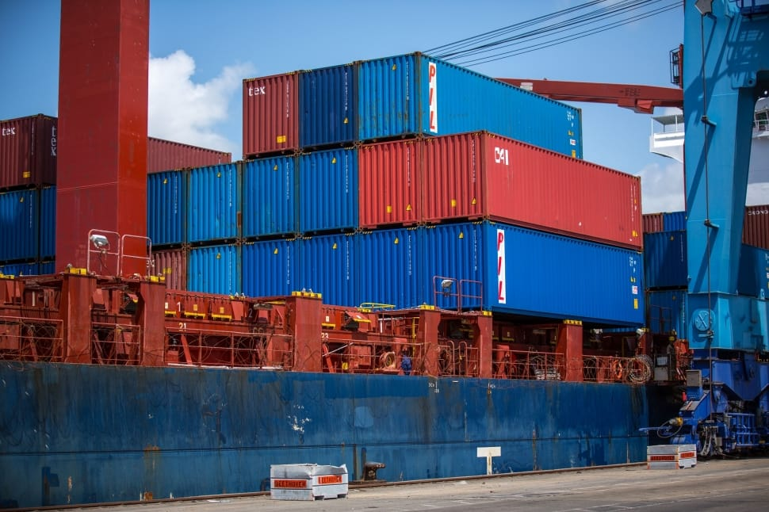
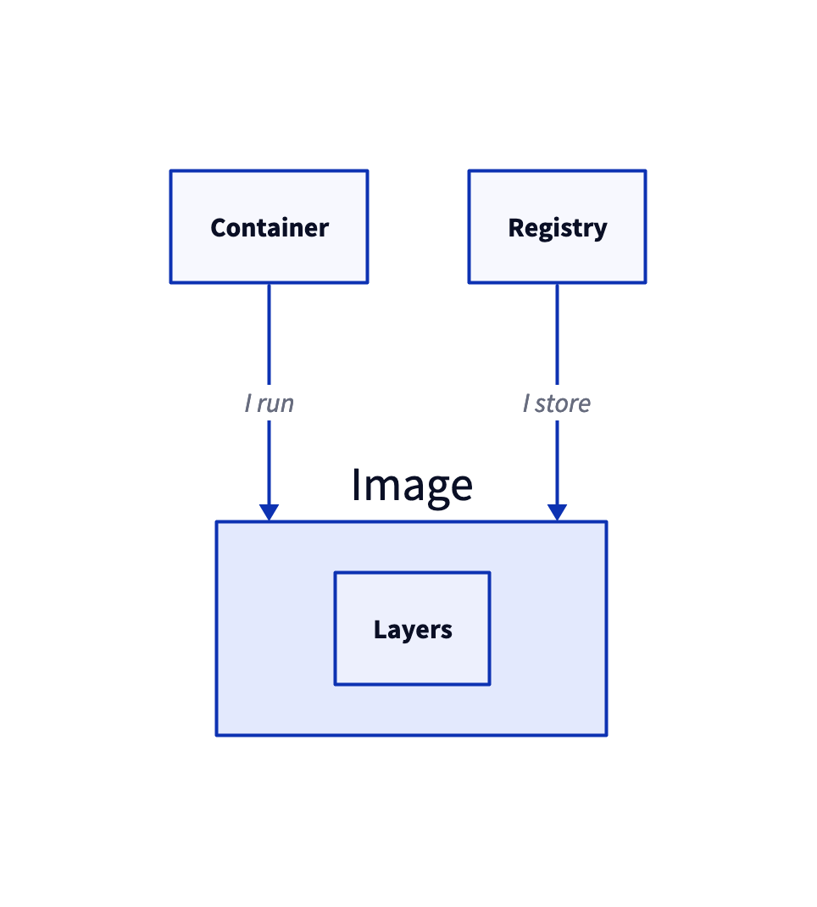
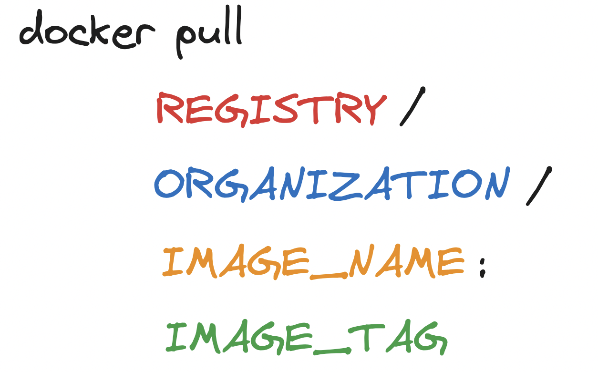
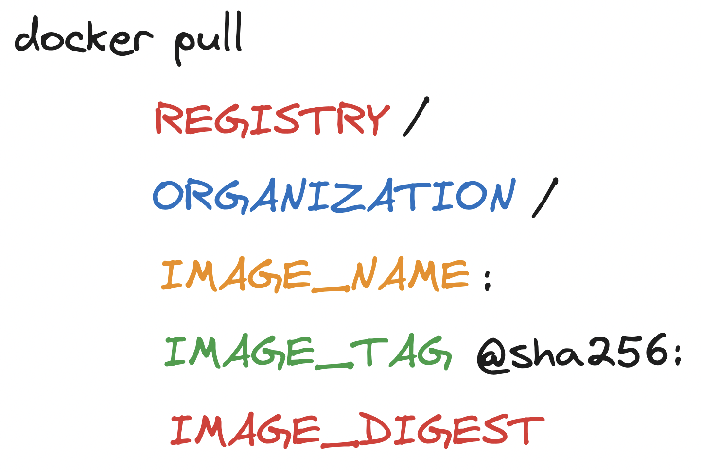
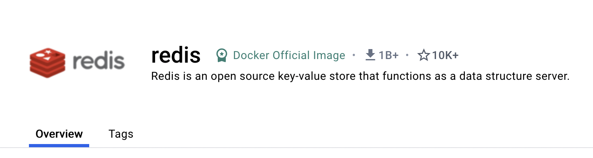

<section data-noprocess class="title-card">
<h2>
    A gentle introduction to containers
</h2>
  Zach Lipp (he/him/his)

  S2 '24

  2024-04-03
</section>

---

### Goals
- Introduce high level container concepts
- Provide an overview of the Docker CLI
- Encourage new adopters to use containers

---

### Roadmap
- Reviewing container concepts
- Introducing `docker`
- Unpacking common `docker` commands
- Introducing `docker compose`

---

### Reviewing container concepts

---

### What are containers?

**Containers** run application code in an isolated, reproducible, and portable environment

{}



{}

---

### Why containers?
{}
1. Isolate and reproduce an application you are developing
2. Standardizing your build requirements
3. Giving you a simpler entrypoint to someone else's application
{}

---

### Containers and images

**Containers** are running instances of **images**.

{}
An **image** is a compressed collection of files and dependencies
{}

{}
Images consists of **layers**
{}

{}
Images are stored in **registries**
{}

---

### Containers and images



---

### Containers are almost always Linux

Linux containers work by sharing the host's kernel

{}
🙋: You aren't using Linux but you are using Docker
{}

{}
- Docker Desktop (Mac, Windows) runs an entire Linux VM
{}

{}
- Apple silicon needs ARM-based images
{}

---

# Introducing Docker

---

### Demo: Running an image

---

### What the heck happened?

- Let's walk through it!

---

## `docker pull`

---

### `docker pull` hides a lot

{}
```terminal
docker pull hello-world
```
{}
{}
```terminal
docker pull hello-world:latest
```
{}
{}
```terminal
docker pull docker.io/hello-world:latest
```
{}
{}
```terminal
docker pull docker.io/library/hello-world:latest
```
{}
{}
```terminal
docker pull docker.io/library/hello-world:latest@sha256:a26bff933ddc26d5cdf7faa98b4ae1e3ec20c4985e6f87ac0973052224d24302
```
{}

---



### `docker pull` broken down



---



### `docker pull` broken down more



---

### A full `docker pull` example

```terminal
docker pull gcr.io/distroless/java17-debian12:latest@sha256:bf9b3faf63d2d74f28920711067a56ce1caa8000b619dbcf0bcccb9b48d3d155
```

---

## `docker run`

---

### Common `docker run` arguments
{}
- `--name`: name the container
- positional: the name (and tag) of the image to run
```terminal
docker run --name hello-world hello-world
```
{}
{}

- `--rm`: delete the container after the entrypoint exits
```terminal
docker run --rm hello-world:latest
```
{}
{}

- `-v`: mount a volume into the container
```terminal
docker run \
    -v $(pwd)/these/host/files:/this/container/dir \
    hello-world
```
{}

---

### Common `docker run` arguments

- `-p`: forward a port from the container to the host

```terminal
docker run \
    -p 8000:80 # host_port:container_port \
    nginx
```

{}

- `-it`: interactive teletype
- `--entrypoint`: set a new entrypoint

```terminal
docker run \
  -it \
  --entrypoint bash \ # try sh if bash isn't there
  nginx
```
{}

---

### Common `docker run` arguments

- `-e`: set an environment variable in the container

```terminal
docker run \
  -e WORLD=world \
  --entrypoint env \
  --rm \
  nginx
```

---

## `docker build`

---

### Introducing `Dockerfile`s


- `docker build` works on a file format called a `Dockerfile`

---



### Example `Dockerfile`

[Source](https://github.com/zachlipp/sockpuppet-detector/blob/main/Dockerfile)

```dockerfile
FROM python:3.11-slim

WORKDIR home

COPY requirements.txt .

RUN pip install -r requirements.txt

COPY src .

COPY tests tests

ENTRYPOINT uvicorn --host 0.0.0.0 --port 1337 main:app
# ENTRYPOINT pytest
```

---



### Example `Dockerfile`

`FROM`: Specifies the base image, usually the first layer

```dockerfile {hl_lines=["1"],linenostart=1}
FROM python:3.11-slim

WORKDIR home

COPY requirements.txt .

RUN pip install -r requirements.txt

COPY src .

COPY tests tests

ENTRYPOINT uvicorn --host 0.0.0.0 --port 1337 main:app
# ENTRYPOINT pytest
```

---



### Example `Dockerfile`

`WORKDIR`: Changes the directory in the image

```dockerfile {hl_lines=["3"],linenostart=1}
FROM python:3.11-slim

WORKDIR home

COPY requirements.txt .

RUN pip install -r requirements.txt

COPY src .

COPY tests tests

ENTRYPOINT uvicorn --host 0.0.0.0 --port 1337 main:app
# ENTRYPOINT pytest
```

---



### Example `Dockerfile`

`COPY`: Copies files from the host to the image

```dockerfile {hl_lines=["5","9","11"],linenostart=1}
FROM python:3.11-slim

WORKDIR home

COPY requirements.txt .

RUN pip install -r requirements.txt

COPY src .

COPY tests tests

ENTRYPOINT uvicorn --host 0.0.0.0 --port 1337 main:app
# ENTRYPOINT pytest
```

---



### Example `Dockerfile`

`RUN`: Run a command while building the image

```dockerfile {hl_lines=["7"],linenostart=1}
FROM python:3.11-slim

WORKDIR home

COPY requirements.txt .

RUN pip install -r requirements.txt

COPY src .

COPY tests tests

ENTRYPOINT uvicorn --host 0.0.0.0 --port 1337 main:app
# ENTRYPOINT pytest
```

---



### Example `Dockerfile`

`ENTRYPOINT`: the container's default command

```dockerfile {hl_lines=["13"],linenostart=1}
FROM python:3.11-slim

WORKDIR home

COPY requirements.txt .

RUN pip install -r requirements.txt

COPY src .

COPY tests tests

ENTRYPOINT uvicorn --host 0.0.0.0 --port 1337 main:app
# ENTRYPOINT pytest
```
---



### Each command is a layer
...and each layer is cached

{}
```dockerfile {hl_lines=["1", "3", "5", "7", "9", "11", "13"],linenostart=1}
FROM python:3.11-slim

WORKDIR home

COPY requirements.txt .

RUN pip install -r requirements.txt

COPY src .

COPY tests tests

ENTRYPOINT uvicorn --host 0.0.0.0 --port 1337 main:app
# ENTRYPOINT pytest
```
{}

---

### Common `docker build` arguments

{}
- `-t`: A tag for the image, practically necessary
{}
{}
- `positional arg`: The **build context**
    - `COPY` commands are relative to this path
    - `COPY` commands cannot look above the build context
    - Usually the project root
{}
{}
- `-f`: The path to the `Dockerfile`. If not set, looks for `build_context/Dockerfile`
{}

---

### Example `docker build` command
```terminal
docker build \
    -t REGISTRY/ORGANIZATION/IMAGE_NAME:IMAGE_TAG \
    .
```
---

### Other docker commands
- `docker push`: Push an image to a registry
- `docker exec`: Start a shell in a running container
- `docker logs`: View stdout/stderr for a container
- `docker rm/rmi`: Remove stopped containers/images

---

# DEEP BREATH

{}
Why are there so many commands? And why are they so weird?
{}

---

# 💡

{}
We don't have to use the base `docker` client
{}

---

## Introducing `docker compose`

---

### Introducing `docker compose`

`docker compose` provides a more standard experience for working with `Dockerfiles`

{}
`docker compose` lets us codify a lot of the specifics the `docker` CLI expects in arguments
{}

---

### Example service

{}
FizzBuzz as a Service (FBaaS)

[Source](https://github.com/zachlipp/pycascades_demo_2023/tree/main)
{}

{}

{}

---

### Example `docker-compose.yaml`
[Source](https://github.com/zachlipp/pycascades_demo_2023/blob/main/docker-compose.yaml)

```yaml
version: "3.9"
services:
  hub:
    build: example-services/hub
    ports:
      - "6000:6000"
    environment:
      FIZZER_PORT: 6001
      BUZZER_PORT: 6002
  fizzer:
    build: example-services/fizzer
  buzzer:
    build: example-services/buzzer
  jaeger:
    image: jaegertracing/all-in-one:1.42.0
    profiles:
      - tracing
    ports:
      # UI
      - "16686:16686"
    environment:
      COLLECTOR_OTLP_ENABLED: true
      LOG_LEVEL: info
```

---

### Demo

---



### Summary

{}
- We discussed container concepts and built up our vocabulary
{}
{}
- We introduced the `docker` tool and CLI commands
{}
{}
- We simplified the `docker` CLI with `docker compose`
{}

---

### Closing note: `docker` opens doors

You don't have to be an expert sysadmin to try out a database (or cache, or distributed tracing visualizer...)

---

### Closing note: Go nuts

[dockerhub's most pulled images](https://hub.docker.com/search?image_filter=official&type=image&q=)

{}

{}
{}

{}

---

### Thanks!
