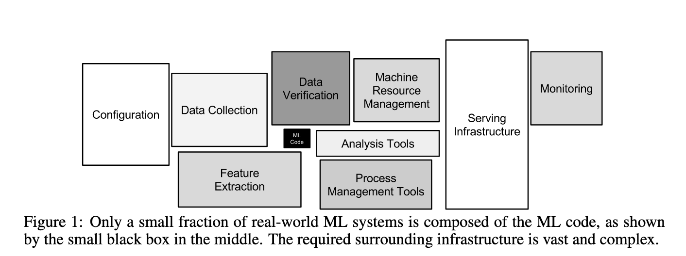

### Migrating a machine learning pipeline to Kubernetes

Zach Lipp

he/him

Senior Software Engineer, Lumere

19 February 2020

---

### Problem overview

We want to help our team of expert medical researchers classify hospital purchases

{}

<table style="font-size:25px;">
<thead>
<tr>
<th>Field</th>
<th>Data Type</th>
<th>Example</th>
</tr>
</thead>
<tbody><tr>
<td>Cost</td>
<td>Float</td>
<td><code>0.01</code></td>
</tr>
<tr>
<td>Description</td>
<td>String</td>
<td><code>SUT SILK 3-0 SA74H</code></td>
</tr>
<tr>
<td>Contract</td>
<td>String</td>
<td><code>SUTURE PRODUCTS</code></td>
</tr>
<tr>
<td>Department</td>
<td>String</td>
<td><code>SURGERY</code></td>
</tr>
</tbody>
</table>

{}

{}

<strong>Category</strong>: Sutures

{}

---

### Problem overview

You don't need to be an expert for some of these

<table style="font-size:25px;">
<thead>
<tr>
<th>Field</th>
<th>Data Type</th>
<th>Example</th>
</tr>
</thead>
<tbody>
<tr>
<td>Contract</td>
<td>String</td>
<td><code><strong>SUTURE PRODUCTS<strong></code></td>
</tr>
</tbody>
</table>

<strong>Category</strong>: Sutures

---

### Enter machine learning!

We can use the text descriptions as inputs to classification models. This is called *short text classification*.

{}
<iframe width=300px height=350px src="https://lmgtfy.com/?q=short+text+classification&pp=1&s=d">
</iframe>
{}

---

### Machine learning deployment

<table style="font-size: 22px;">
<thead>
<tr>
<th style="font-size: 25px;">Modeling</th>
<th style="font-size: 25px;">Delivery</th>
<th style="font-size: 25px;">Pros</th>
<th style="font-size: 25px;">Cons</th>
</tr>
</thead>
<tbody>

<tr>
<td>Jupyter</td>
<td>Excel</td>
<td><ul><li>It works!</li></ul></td>
<td><ul><li>Time intensive (for all parties)</li><li>Manual</li></ul></td>
</tr>

<tr>
<td>ECS</td>
<td>Django</td>
<td><ul><li>Delivery much simpler</li><li>Does not require data scientist to run models</li></ul></td>
<td><ul><li>Expensive</li><li>Error-prone</li><li>Scaling problems</li></ul></td>
</tr>

<tr>
<td>Kubernetes</td>
<td>Django</td>
<td><ul><li>Delivery the same</li><li>Fault-tolerant</li><li>Built for scale</li></ul></td>
<td><ul><li>Distributing software is hard</li><li>TBD</li></td>
</tr>

</tbody>
</table>

---

### Results
- Our reconfigured pipeline is faster end-to-end
- We no longer require manual modeling runs
- Improved monitoring and observability
- Models are written to disk
- We parallelized model training, predicting, and preprocessing
- We distribute and schedule work with Dask

---

### Configuration
- Two `Deployments` (Dask workers, scheduler)
- Three `CronJobs` (training, predicting, refreshing training data)

---

### Lessons learned
#### 1. Know your APIs

- scikit-learn has great functionality for building pipelines
{}
  - `Pipeline`
{}
{}
  - `FunctionTransformer`
{}
{}
  - `ColumnTransformer`
{}
- pandas can save your database some munging
{}
  - `DataFrame.groupby`
{}
{}
  - `.to_sql()`
{}

---

### Lessons learned
#### 2. Treat ML code like application code 

{}

From <em>Hidden Technical Debt in Machine Learning Systems</em>, NIPS 2015

{}

---

### Lessons learned
#### 2. Treat ML code like application code

By adapting old code to meet our new data model and make use of pandas over SQL, we avoided some costly joins and aggregations, leading to a **5-6 orders of magnitude** speedup

---

### Lessons learned
#### 3. Avoid premature optimization

{}
**One success**:
 
We focused on migrating models as-is while independently researching better models
{}

{}
**One ~~failure~~ opportunity for improvement:**
 
Dask fails silently and fails often
{}

---

### Lessons learned
1. Know your APIs
2. Treat ML code like application code
3. Avoid premature optimization

---

# Fin
