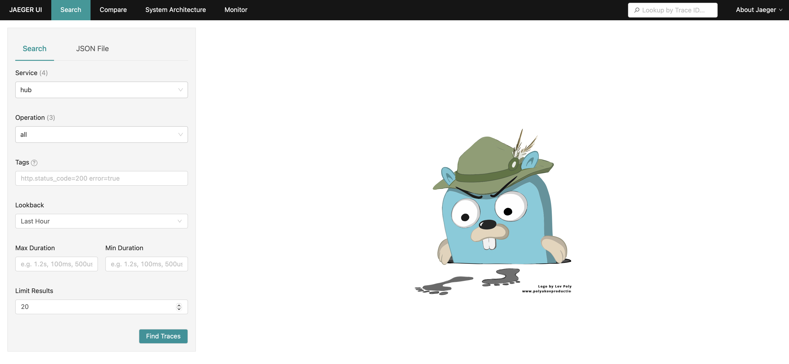
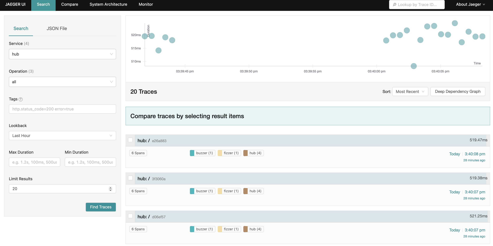
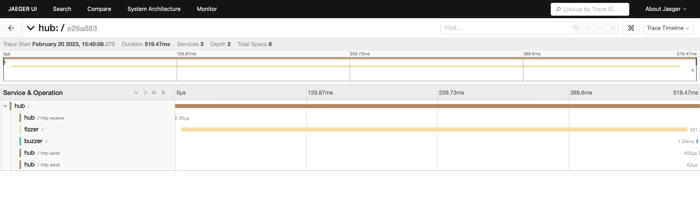
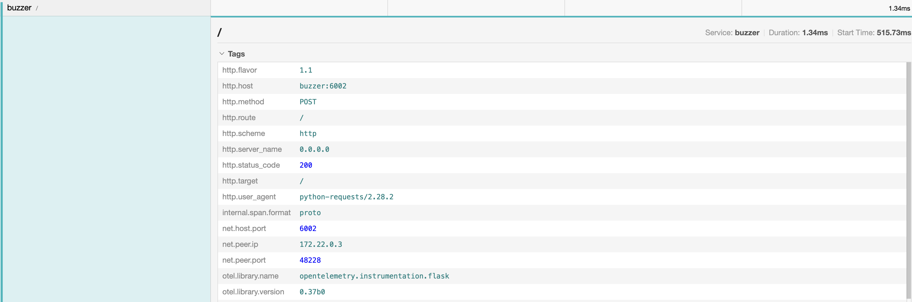
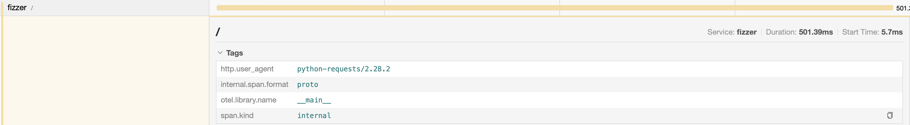

<section data-noprocess class="title-card">
<h3>
  Implementing Distributed Tracing
</h3>
  Zach Lipp (he/him/his)

  Senior Machine Learning Engineer, Numerator

  24 February 2023
</section>

---

### Distributed tracing: A brief introduction

- Distributed tracing (hereafter tracing) is an observability tool
- Tracing follows a request through a distributed system

---


### Distributed tracing: A brief introduction

{}
- **Traces** follow a request through an entire system
{}
{}
- A trace contains one or more (usually more) **spans** which represent units of work. (A function, a service, etc.)
{}
{}
- Spans can have arbitrary data associated with them. We can call these key-value pairs **tags** or **attributes**
{}

---

### Distributed tracing: A brief introduction

{}
- Tracing is an open standard. There are tons of open source and vendored tracing tools
{}
{}
- `opentelemetry` sets standards for creating and propogating traces
{}
{}
- `zipkin` and `jaeger` is a common tool for collecting and visualizing traces (here we'll use `jaeger`)
{}

---

### Example: Fizzbuzz

{}
- Given an integer `x`:
  - If `x` is divisible by 3, return `"Fizz"`
  - If `x` is divisible by 5, return `"Buzz"`
  - If `x` is divisible by 15, return `"FizzBuzz"`
{}

---

### Example system: Fizzbuzz

Introducing **FBaaS - FizzBuzz as a Service**

{}
https://github.com/zachlipp/pycascades_demo_2023
{}

---

### Example system: Fizzbuzz



---

### Example system: Fizzbuzz

- `docker-compose` exposes the hub at `localhost:6000`
- We can send a request for an integer `x` to it with the payload `{"number": x}`

---

### Example system: Fizzbuzz


---

### Why is this taking so long?

Let's trace it!

(Available at branch `tracing-example`)

---

### Distributed tracing: Visualized



---

### Distributed tracing: Visualized



---

### Distributed tracing: Visualized



This is what's called **the traceview**

---

### What's going on here?

Two ways to think about that question:
1. How does this work under the hood?
2. What does the Python code for this look like?

---

### How does tracing work?

Tracing HTTP requests works by propogating headers through each component of your system.

Two headers are required by the [W3C standards](https://www.w3.org/TR/trace-context/):

{`traceparent`: `...`, `tracestate`: `...`}

Where the `tracestate` is for vendor information

---

### How does tracing work?

- The value of the `traceparent` header includes:
{}
  - `version_id`, for opentelemetry, `00`
{}
{}
  - `trace_id`, a 16 bytes hex digit
{}
{}
  - `parent_id` or `span-id`, an 8 bytes hex digit
{}
{}
   - `trace_flags`, for opentelemetry, `00`
{}

{}
- Therefore a `traceparent` will look like `f"00-{trace_id}-{span_id}-00"`
{}

---

### What happens from here?

- The application:
{}
  - Records spans
{}
{}
  - Consumes headers from requests to determine if this span belongs to an existing trace
{}
{}
  - A collector collects the trace and sends it to a backend service
{}
{}
  - The backend service stores the trace
{}
{}
  - A frontend allows users to visualize traces from the backend
{}

---

### How do you implement this in Pyton?

Tracing requires application code changes (and, in some cases, build changes).

---

### How do you implement this in Pyton?

{}
`opentelemetry` has a rich collection of open source packages
{}
{}
It's even possible to `autoinstrument` popular servers
  - `Django`
  - `Flask`
  - `FastAPI`
{}

---

### Configure your exporter

```python
from opentelemetry import trace
from opentelemetry.exporter.otlp.proto.grpc.trace_exporter import (
    OTLPSpanExporter,
)
from opentelemetry.sdk.resources import Resource
from opentelemetry.sdk.trace import TracerProvider
from opentelemetry.sdk.trace.export import BatchSpanProcessor


resource = Resource(attributes={"service.name": SERVICE_NAME})
trace.set_tracer_provider(TracerProvider(resource=resource))
tracer = trace.get_tracer(__name__)
otlp_exporter = OTLPSpanExporter(endpoint="http://jaeger:4317", insecure=True)
span_processor = BatchSpanProcessor(otlp_exporter)
trace.get_tracer_provider().add_span_processor(span_processor)
```

---

### Autoinstrumentation: FastAPI (`hub`)

```diff
+from opentelemetry.propagate import inject
+from opentelemetry.instrumentation.fastapi import FastAPIInstrumentor


def call_remote_service(
  number: int, service: Literal["fizzer", "buzzer"]
)
+    headers = {}
+    inject(headers)
-    response = requests.post(url, json={"number": number})
+    response = requests.post(url, json={"number": number}, headers=headers)
ders)


app = FastAPI()
+FastAPIInstrumentor.instrument_app(app)
```

---

### Autoinstrumentation: Flask (`buzzer`)

```diff
-from flask import Flask, jsonify, request
+import json
+
+from flask import Flask, make_response, request
+from opentelemetry.propagate import inject
+from opentelemetry.instrumentation.flask import FlaskInstrumentor

app = Flask(__name__)
+FlaskInstrumentor().instrument_app(app)

@app.route("/", methods=["POST"])
def buzz():
+    headers = {"Content-Type": "application/json"}
+    inject(headers)
     x = request.json["number"]
     buzz = bool(x % 5 == 0)
-    return jsonify({"result": buzz})
+    return make_response(json.dumps({"result": buzz}), 200, headers)
```

---

### Manual instrumentation (`fizzer`)
```diff
+from opentelemetry import trace
+from opentelemetry.context import Context
+from opentelemetry.propagate import inject
+from opentelemetry.trace.propagation import tracecontext
+
+FORMAT = tracecontext.TraceContextTextMapPropagator()

@app.route("/", methods=["POST"])
def fizz():
-    x = request.json["number"]
-    fizz = bool(x % 3 == 0)
-    return jsonify({"result": fizz})
+    traceparent = request.headers.get("traceparent")
+    with tracer.start_as_current_span(
+        "/", context=FORMAT.extract({"traceparent": traceparent})
+    ) as fizzspan:
+        headers = {}
+        inject(headers)
+        x = request.json["number"]
+        fizz = bool(x % 3 == 0)
+        return make_response(json.dumps({"result": fizz}), 200, headers)
```

---

### Manual vs auto


---

### Manual vs auto


{}
```python
...
   with tracer.start_as_current_span(
       "/", context=FORMAT.extract({"traceparent": traceparent})
   ) as fizzspan:
         user_agent = request.headers.get("user-agent")
         fizzspan.set_attribute("http.user_agent", user_agent)
...
```
{}

---

### Is this worth it?

{}
Tracing is clearly a complicated solution.
{}

{}
Debugging and monitoring distributed systems is a complicated problem.
{}

---

### Is it worth it? Alternatives

{}
Running a service mesh has observability and security benefits and can provide [some of the functionality](https://linkerd.io/2019/08/09/service-mesh-distributed-tracing-myths/) of tracing, including identifying which services communicate and their latency.
{}

{}
There's promising work to approximate tracing in the Envoy service mesh without propogating headers, see Sachin Ashok and Vipul Harsh's [presentation at envoycon last year](https://www.youtube.com/watch?app=desktop&v=xSoF5XRx8l8).
{}

---

### What else can traces do?

In a [wonderful post](https://copyconstruct.medium.com/distributed-tracing-weve-been-doing-it-wrong-39fc92a857df), Cindy Sridharan suggests other ways of thinking about traces. In particular,
- Preferring visualizations of interconnected services to the entire system
- Using traces as an analytical debugging tool to pinpoint the affects of changes in complicated systems

---

### What else can traces do?

In response, Dan Luu offers [some concrete examples](https://danluu.com/tracing-analytics/) of questions analyzing traces can answer:


{}
> - For this service that's having problems, give me a representative set of traces
> - For this service that has elevated load, show me which upstream service is causing the load
> - Give me the list of all services that have unusual write amplification to downstream service X
{}

---

### Summary

{}
- Tracing is a valuable observability tool, but its implementation can require substantial changes
{}
{}
- When considering tracing, consider alternatives that don't require application code changes
{}
{}
- To get the most value from tracing, replicate trace data to a SQL-compatible backend and let developers query it directly
{}
