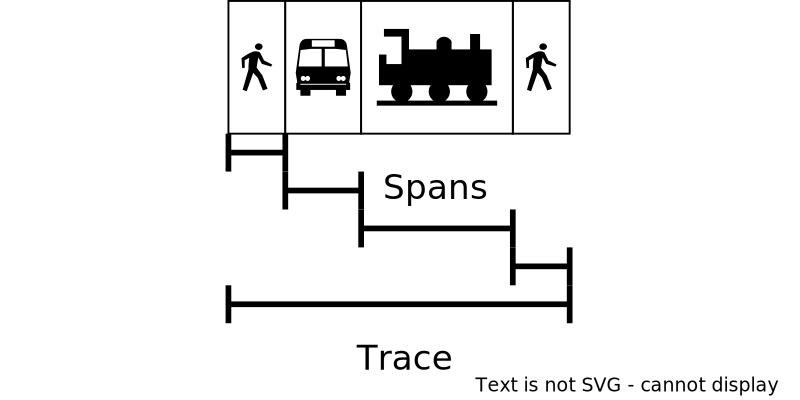

<section data-noprocess class="title-card">
<h3>
  Implementing Distributed Tracing
</h3>
  Zach Lipp (he/him/his)

  Senior Machine Learning Engineer, Numerator

  24 February 2023
</section>

---

### Roadmap

- What is distributed tracing?
- Tracing by metaphor
- Distributed tracing concepts
- Example system: Overview
- Example system: Jaeger
- How tracing works
- Example system: Code
- Tracing review

---

### What is distributed tracing?

Distributed tracing (hereafter tracing) is an observability tool

Tracing follows a request through a distributed system

---

### Tracing by metaphor

{}
#### Commuting
{}

---

### Tracing by metaphor


---



### Tracing by metaphor


---



### Tracing by metaphor



---



### Tracing by metaphor


---



### Tracing by metaphor


---



### Distributed tracing concepts

{}
**Traces** follow a request through an entire system
{}
{}
**Spans** make up traces
{}
{}
**Tags** or **attributes** record information about spans
{}
{}
Tags don't have set schemas
{}

---



### Distributed tracing concepts

{}
Tracing is an open standard
{}
{}
Client: `opentelemetry` (formerly `opentracing`)
{}
{}
Server: `jaeger`
{}

---

### Example system: Overview

{}
**Fizzbuzz**
{}

{}
- Given an integer `x`:
  - If `x` is divisible by 3, return `"Fizz"`
  - If `x` is divisible by 5, return `"Buzz"`
  - If `x` is divisible by 15, return `"FizzBuzz"`
{}

---

### Example system: Overview

Introducing **FBaaS - FizzBuzz as a Service**

{}
https://github.com/zachlipp/pycascades_demo_2023
{}

---

### Example system: Overview


---



### Example system: Overview

We have the `hub` running at `localhost:6000`

It accepts JSON payloads `{"number": x}`

We'll use a bash for loop to fizzbuzz numbers 1-15

---

### Example system: Overview


---


### Example system: Overview

Seems kind of slow... let's trace it

(Available at branch `tracing-example`)

---

### Example system: Jaeger


---

### Example system: Jaeger


---

### Example system: Jaeger


This is what's called **the traceview**

---

### How tracing works

Two ways to think about that question:
1. How does this work under the hood?
2. What does the Python code for this look like?

---

### How tracing works

Programs need **context** to associate traces together

{}

{}

---



### How tracing works

{}
Tracing works by **propogating** HTTP headers through the system
{}

{}
`{"traceparent": "f"00-{trace_id}-{span_id}-00"}`
{}

{}
Check out the [W3C standards](https://www.w3.org/TR/trace-context/) for more information
{}

---



### How tracing works

{}
- The program creates a span associated with a trace
{}
{}
- A collector collects the trace and sends it to a backend service
{}
{}
- The backend service stores the trace
{}
{}
- A frontend allows users to visualize traces from the backend
{}

---

### Example system: Code


---

### Example system: Code

{}
`opentelemetry` has a rich collection of open source packages
{}
{}
It's even possible to `autoinstrument` popular servers
  - `FastAPI`
  - `Flask`
{}
{}
We'll look at `diff`s to emphasize what implementing tracing does
{}

---

### Example system: Code
#### Configure the exporter

{}
```python
from opentelemetry import trace
from opentelemetry.exporter.otlp.proto.grpc.trace_exporter import (
    OTLPSpanExporter,
)
from opentelemetry.sdk.resources import Resource
from opentelemetry.sdk.trace import TracerProvider
from opentelemetry.sdk.trace.export import BatchSpanProcessor


resource = Resource(attributes={"service.name": SERVICE_NAME})
trace.set_tracer_provider(TracerProvider(resource=resource))
tracer = trace.get_tracer(__name__)
otlp_exporter = OTLPSpanExporter(endpoint="http://jaeger:4317", insecure=True)
span_processor = BatchSpanProcessor(otlp_exporter)
trace.get_tracer_provider().add_span_processor(span_processor)
```
{}

---



### Example system: Code
#### FastAPI (`hub/main.py`)

```python
def call_remote_service(
    number: float, service: Literal["fizzer", "buzzer"]
) -> bool:
    url = get_service_address(service)
    response = requests.post(url, json={"number": number})
    response_payload = response.json()
    return response_payload["result"]


app = FastAPI()


@app.post("/")
def fizzbuzz(nc: NumberContainer):
    number = nc.number
    fizz = call_remote_service(number, "fizzer")
    buzz = call_remote_service(number, "buzzer")
    ...

```

---



### Example system: Code
#### FastAPI (`hub/main.py`)


```diff
+from opentelemetry.propagate import inject
+from opentelemetry.instrumentation.fastapi import FastAPIInstrumentor


def call_remote_service(
  number: int, service: Literal["fizzer", "buzzer"]
)
+    headers = {}
+    inject(headers)
-    response = requests.post(url, json={"number": number})
+    response = requests.post(url, json={"number": number}, headers=headers)
ders)


app = FastAPI()
+FastAPIInstrumentor.instrument_app(app)
```

---

### Autoinstrumentation: Flask (`buzzer`)

```diff
-from flask import Flask, jsonify, request
+import json
+
+from flask import Flask, make_response, request
+from opentelemetry.propagate import inject
+from opentelemetry.instrumentation.flask import FlaskInstrumentor

app = Flask(__name__)
+FlaskInstrumentor().instrument_app(app)

@app.route("/", methods=["POST"])
def buzz():
+    headers = {"Content-Type": "application/json"}
+    inject(headers)
     x = request.json["number"]
     buzz = bool(x % 5 == 0)
-    return jsonify({"result": buzz})
+    return make_response(json.dumps({"result": buzz}), 200, headers)
```

---

### Manual instrumentation (`fizzer`)
```diff
+from opentelemetry import trace
+from opentelemetry.context import Context
+from opentelemetry.propagate import inject
+from opentelemetry.trace.propagation import tracecontext
+
+FORMAT = tracecontext.TraceContextTextMapPropagator()

@app.route("/", methods=["POST"])
def fizz():
-    x = request.json["number"]
-    fizz = bool(x % 3 == 0)
-    return jsonify({"result": fizz})
+    traceparent = request.headers.get("traceparent")
+    with tracer.start_as_current_span(
+        "/", context=FORMAT.extract({"traceparent": traceparent})
+    ) as fizzspan:
+        headers = {}
+        inject(headers)
+        x = request.json["number"]
+        fizz = bool(x % 3 == 0)
+        return make_response(json.dumps({"result": fizz}), 200, headers)
```

---

### Manual vs auto


---

### Manual vs auto


{}
```python
...
   with tracer.start_as_current_span(
       "/", context=FORMAT.extract({"traceparent": traceparent})
   ) as fizzspan:
         user_agent = request.headers.get("user-agent")
         fizzspan.set_attribute("http.user_agent", user_agent)
...
```
{}

---

### Python over! Now what?

{}
Let's talk about results!
{}

---

### Tracing: Lessons learned

- My team identified a large bottleneck in our own codebase with autoinstrumentation
- After creating a manual span, we isolated a bottelneck to one of our dependencies

---

### Is this worth it?

{}
Tracing is clearly a complicated solution
{}

{}
This is a complicated problem
{}

---

### Is it worth it? Alternatives

{}
[Service meshes](https://linkerd.io/2019/08/09/service-mesh-distributed-tracing-myths/) can identify latency
{}

{}
It's possible to approximate tracing without header propogation, see [Sachin Ashok and Vipul Harsh](https://www.youtube.com/watch?app=desktop&v=xSoF5XRx8l8)
{}

---

### Is it worth it? Getting more value

{}
[**Go beyond the traceview**](https://copyconstruct.medium.com/distributed-tracing-weve-been-doing-it-wrong-39fc92a857df)
{}

{}
Services can operate on traces (e.g. demarcating types of traffic)
{}

{}
Teams can use traces to directly analyze traffic across service paths
{}

{}
[If traces are backed up to a SQL storage (or use a SQL-like tool)]((https://danluu.com/tracing-analytics/), engineers can easily build custom analyses and tools
{}

---

### Summary

{}
- Tracing is a valuable observability tool, but its implementation can require substantial changes
{}
{}
- When considering tracing, consider alternatives that don't require application code changes
{}
{}
- To get the most value from tracing, replicate trace data to a SQL-compatible backend and let developers query it directly
{}
