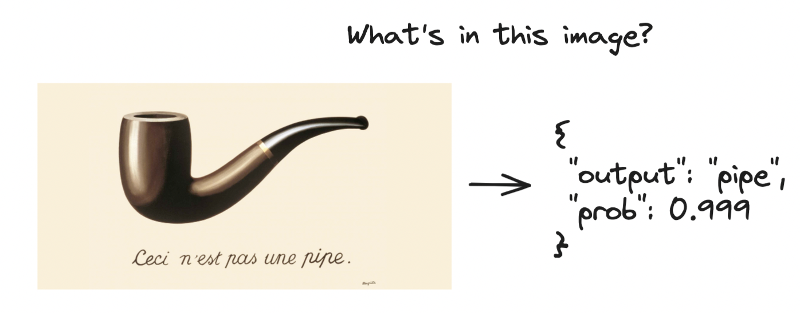
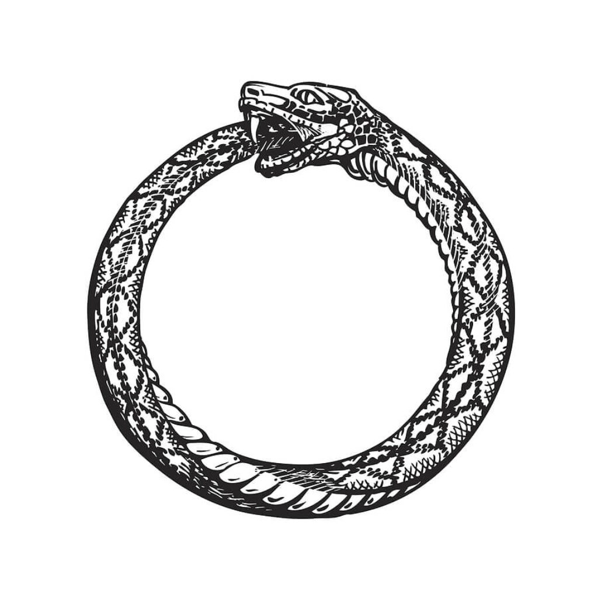
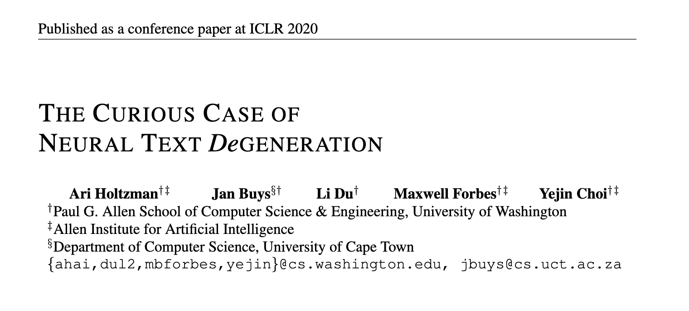
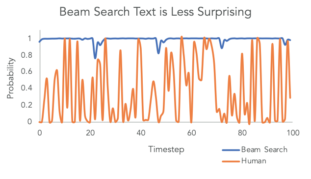

## Sampling in generative models

---

### Classification

1. Get scores
2. Select prediction that maximizes scores
---

### Classification



---

### Generation

1. Get scores
2. Select some prediction (maximizes scores?)
3. Get scores with new prediction
4. Select some prediction...

---

### Generation



---

### Paper



---

### Maximizing scores doesn't work
Beam Search, b=32:
```text
Universidad Nacional Autónoma de México (UNAM) and
the Universidad Nacional Autónoma de México
(UNAM/Universidad Nacional Autónoma de
México/Universidad Nacional Autónoma de
México/Universidad Nacional Autónoma de...
```
---

### Natural language is pretty random



---

### Random sampling doesn't work

Pure Sampling:
```text
Professor Chuperas Omwell told Sky News. "They've only
been talking to scientists, like we're being interviewed by TV
reporters. We don't even stick around to be interviewed by
TV reporters.
```
---

### Top-p (nucleus sampling)

```python
import torch as t
def nucleus_sample(probs: t.Tensor, p: float):
    values, indices = probs.sort(dim=-1, descending=True)
    cumsum = values.cumsum(dim=-1)
    close_mask = cumsum <= p
    mask = t.cat(
        [
            close_mask.new_ones(size=(close_mask.shape[0], 1)),
            close_mask[..., :-1]
        ], dim=-1)
    values[~mask] = 0
    values = values / values.sum(dim=-1, keepdims=True)
    sample_values = t.multinomial(values, num_samples=1)
    return indicies.gather(index=sample_values, dim=-1)
```
---

### Top-p (nucleus sampling)


---

## APP DEMO
